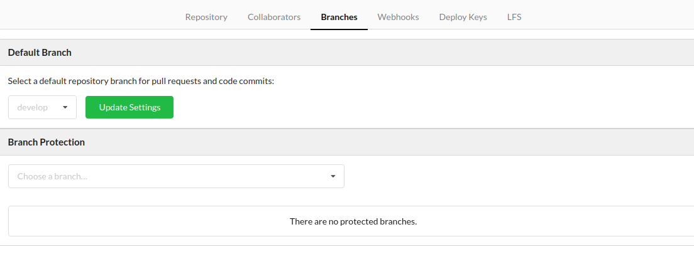
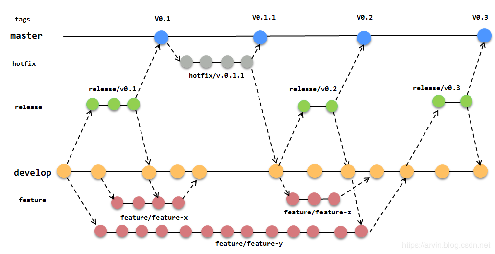
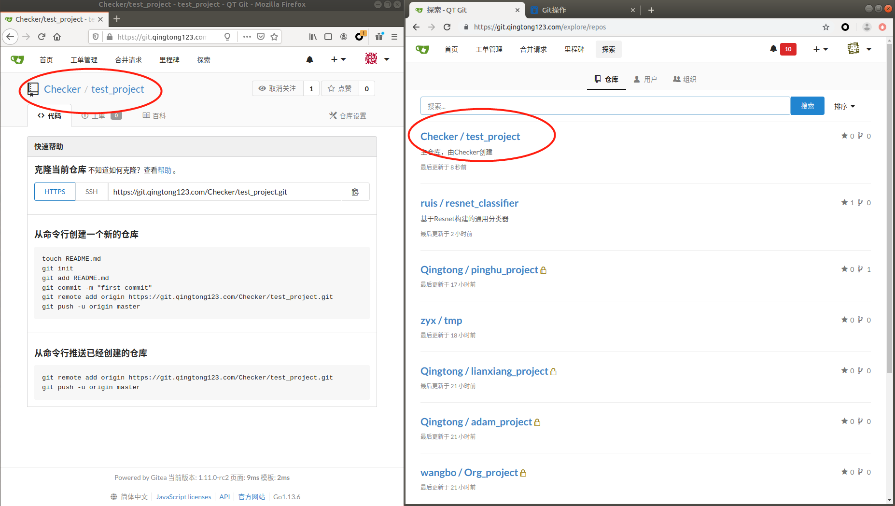
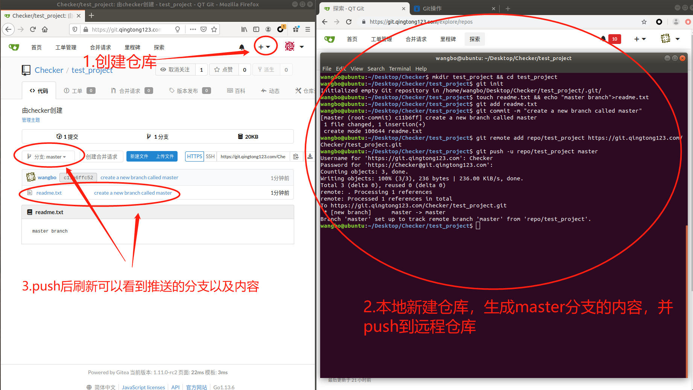
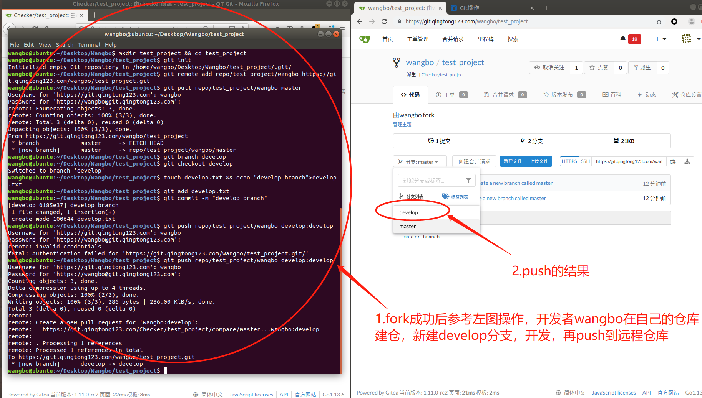
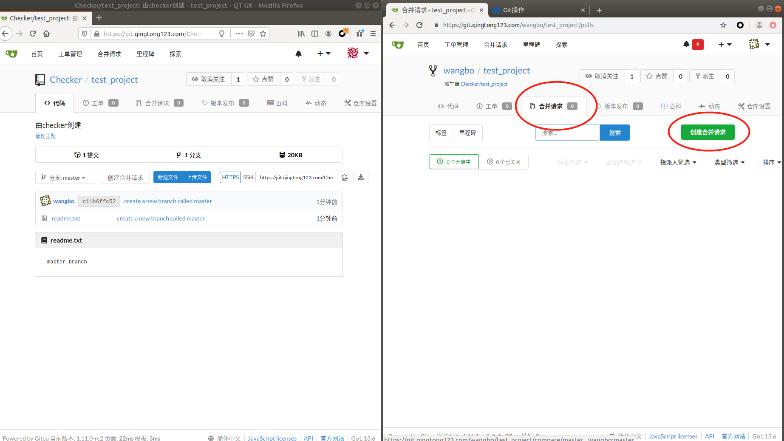
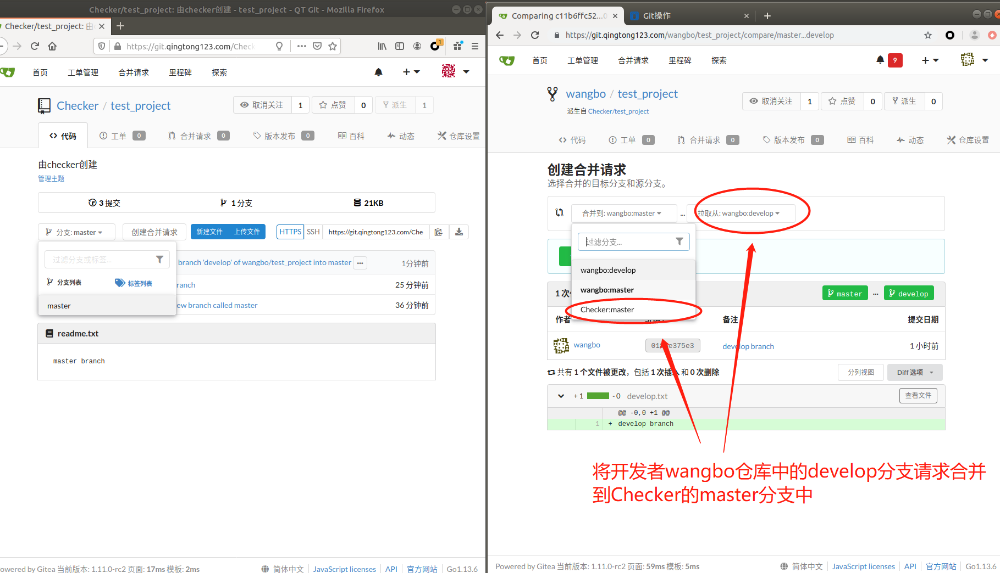
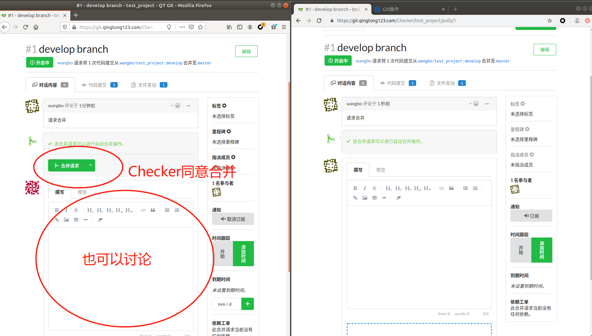

# GitFlow项目介绍

为更好的管理和控制我们的代码，并且能够有力的协作开发，将采用我们裁剪的Git工作流模式。

## 术语定义
- gitweb = 服务器上git的web平台，用于存放代码。如github, 内部的gitea等

## 总体原则和指导
- **干净**。master干净不被污染，必须可运行。开发主要都在develop上完成，不论本地还是远程。develop测试通过以后，将其合并到master.
- **PR控制**。PR=Pull Request, 合并请求。代码管理的本质是对PR的管理。目标仓库的更改只能通过审核者通过的PR。不能直接更改，保证纯洁性。gitweb上PR面板中可用来审核者和开发者深入交流讨论该PR的细节。鼓励审核者和开发者多交流。
- **分布开发**。每个开发者各开发各的，通过提交PR实现主仓库的功能更新。
- **ISSUES建议**。其他人对项目的一些修改意见，但是无开发权限，如管理层人员之类的，可以通过gitweb上该项目的ISSUES面板提出建议，开发者根据情况回应。鼓励多讨论多提建议。

# 目录

* [Git基本操作](#Git基本操作)
  * [本地操作：](#本地操作)
  * [远程操作](#远程操作)
* [GitFlow简介](#GitFlow简介)
  * [分支简介](#分支简介)
  * [GitFlow流程示范](#GitFlow流程示范)
* [GitFlow 命令指南](#GitFlow命令指南)
* [GitFlow实战演示](#GitFlow实战演示)

# Git基本操作

这里只介绍部分操作，更多git的操作参考[廖雪峰的教程](https://www.liaoxuefeng.com/wiki/896043488029600)。适用于单人本地以及**单人本地远程1对1操作**。本地与远程进行同步推拉(Push,Pull)

## 本地操作
```shell
git init #在一个文件夹下初始化git
git add #将更新过的文件添加到git缓存中
git commit #将添加到缓存中的更新提交到分支中
git branch #在当前分支创建新的分支
git checkout #切换到指定分支
git clone #从某个远程网站克隆一个项目到当前工作路径，url指远程仓库的地址
git pull #远程拉取镜像,remote指远程仓库名，branch指要下载的分支名
git push #将本地分支上传到远程分支
git merge #分支合并
```

## 远程操作
在gitweb平台上，该项目远程仓库上的重要操作：
- Fork：将看中的仓库拉到自己的远程仓库中，由开发者执行
- Pull request：简写成PR，发送子分支合并请求，等待审核(Code Review)，由开发者执行
- Merge request ： 同意合并请求, 由审核者执行

## Tips
- 本地库也开develop分支，这样推送的时候git会匹配分支，将本地的develop推送到远程镜像的develop

- 远程仓库可以在仓库Settings页面中Branches里面设置develop为默认展示分支


- 设置分支上游 git push --set-upstream origin {{REMOTE_BRANCH_NAME}} e.g. 本地分支切换到develop后 git push --set-upstream origin develop, 本地分支与远程分支名称保持一致。

- git stash 合理的使用会简化你的工作。比如git pull的时候要求本地workspace没有临时更改, 但是修改了又没提交怎么办，此时可以git stash保存先藏起来， git pull更新，然后git stash pop再弹出来合并

# GitFlow简介

GitFlow工作流定义了一个围绕项目发布的严格分支模型，它为不同的分支分配了明确的角色，并定义分支之间何时以及如何进行交互。[视频简介](https://www.bilibili.com/video/av32573821/)。适用于**多人操作一个共享仓库的情况**，小范围协作。

## 分支简介

GitFlow主要包含了以下分支：
1. **master分支**：存储正式发布的产品，master分支上的产品要求随时处于可部署状态。master分支只能通过与其他分支合并请求PR来更新内容，禁止直接在master分支进行修改。
1. **develop分支**：汇总开发者完成的工作成果，develop分支上的产品可以是缺失功能模块的半成品，但是已有的功能模块不能是半成品。develop分支只能通过与其他分支合并来更新内容，禁止直接在develop分支进行修改。
1. **feature分支**：当要开发新功能或者试验新功能时，从develop分支创建一个新的feature分支，并在feature分支上进行开发。开发完成后，需要将该feature分支合并到develop分支，最后删除该feature分支。
1. **release分支**：当develop分支上的项目准备发布时，从develop分支上创建一个新的release分支，新建的release分支只能进行质量测试、bug修复、文档生成等面向发布的任务，不能再添加功能。这一系列发布任务完成后，需要将release分支合并到master分支上，并根据版本号为master分支添加tag，然后将release分支创建以来的修改合并回develop分支，最后删除release分支。
1. **hotfix分支**：当master分支中的产品出现需要立即修复的bug时，从master分支上创建一个新的hotfix分支，并在hotfix分支上进行bug修复。修复完成后，需要将hotfix分支合并到master分支和develop分支，并为master分支添加新的版本号tag，最后删除hotfix分支。


## GitFlow流程概述

完整的GitFlow分支适用于中大项目，操作起来较为复杂。在一般的小规模项目中，我们对gitflow实施了定制。只保留核心的master和develop分支，便于实践和推广。

下面用两个账号做示范，一个账号Checker是项目的创建者和审核者（对应于左图）,一个用户wangbo是开发人员（对应于右图）

主要步骤如下，其中双箭头=>表示服务器上repo之间的信息流，通过web按钮实现, 单箭头为本地到服务器之间的信息流：
1. **Init 项目组创建项目**.  Checker/proj. ，由Checker完成，创建项目主仓库Checker/proj，并默认master分支。
1. **Develop 开发者fork项目并开发**. Checker/proj/develop => wangbo/proj/develop <-> wangbo's proj/develop.

   1. 由wangbo fork主仓库到wangbo对该项目的远程镜像仓wangbo/proj，落在git服务器wangbo帐号下，然后wangbo clone到本地仓wangbo's proj。

   2. 创建develop分支。wangbo后续的开发都是基于本地的develop和远程的镜像仓协同开发。
   3. wangbo应实时拉取主仓库，并和本地合并，保持最新状态。

2. **Merge 审核者审核并合并项目**. wangbo/proj/develop => Checker/proj/develop wangbo远程仓ready后. 合并分支，开发者wangbo请求合并自己的远程仓的develop分支到主仓库的develop分支，Checker审核通过
3. **Release 审核者发布版本**. Checker/proj/develop => Checker/proj/master. 审核者Checker根据需求发布，把主仓库develop merge到master，并根据情况打tag

# GitFlow功能命令指南

## 向主库贡献代码

贡献代码的主要步骤是克隆(clone)，开发(develop)与合并(merge)，具体如下：
1. **Fork**. 在gitweb中，目标项目{REMOTE_REPO}={TARGET_USER}/{PROJECT}上点击fork,会生成自己的项目 {USER}/{PROJECT}. e.g. Checker/proj -> wangbo/proj
2. **Clone**. `git clone {URL}`.
3. **Develop**. `git add {FILES}`，`git commit -m "{COMMIT_MESSAGE}"` 进行更新，提交到本地
4. **Push** `git push origin develop` 推送到自己的远程仓库  wangbo/proj/develop
5. **PR**. web上打开`Pull Request` 请求, 等待审核。
6. **Merge**. 审核者Checker会审核你提交的代码，若没问题则接受合并。若有问题，双方在PR面板上交流讨论后，继续改进后续再次提交PR或者开发者说服审核者通过该PR.

当我们睡了一觉起来， 目标仓库(e.g. Checker/proj)可能已经更新，我们要同步最新代码。

## 在本地更新代码

更新本地代码主要是拉取操作(pull)，具体如下：
1. 确保本地在develop分支
2. 给远程的上游仓库Checker/proj配置一个remote。
3. 查看远程状态 `git remote -v` 
4. 配置remote上游. `git remote add {REMOTE_NAME} {REMOTE_REPO}`. e.g：`git remote add team https://xxx.com/Checker/proj.git`
5. 将远程所有的分支fetch下来 `git fetch team` 
6. 合并`git merge team` 
7. 或者`git pull team develop`。 `git pull = fetch + merge`

此时自己本地的代码就是最新的了。功能修改完成后，可继续提交合并请求PR

# GitFlow实战演示
### 1.创建项目

1. 项目启动后，Checker在git服务器上创建一个仓库test_project，这个仓库称为"主仓库"，如下图


2. Checker在自己的本地repo下初始化git，代码如下：

```python

#创建项目文件夹，并进入
mkdir test_project && cd test_project
#初始化git仓库, master branch会默认创建
git init
#新建readme.txt文件并输入内容
touch readme.txt && echo "hello world">readme.txt
#添加一个readme.txt到git缓存区
git add readme.txt
#将缓存区的内容提交，这时会创建一个分支，因为是第一次commit，会默认创建一个master分支，并切换到master分支，以后每次进入这个目录，都会默认进入master分支
git commit -m "创建了master分支"
#这一步是为了给远程仓库创建一个别名，替代冗长的地址
git remote add repo/test_project https://git.qingtong123.com/Checker/test_project.git
#将本地的master分支推送到别名为'Main_Project'的远程仓库的master分支上（这个时候远程仓库并没有master分支，会自动创建），其中第一个master指本地分支，第二个master指远程分支
git push repo/test_project master:master
```
这时刷新远程仓库可以看到已经多了一个develop分支了,如图


### 2.fork 项目并进行开发

>>1. wangbo在服务器上fork项目到自己的仓库（相当于拷贝项目到自己的仓库）

>>2. wangbo从自己的仓库clone项目到本地，代码如下：
```python
    #创建项目文件夹，并进入，
    mkdir test_project && cd test_project
    #这一步是为了给远程仓库创建一个别名，替代冗长的地址
    git remote add repo/test_project/wangbo https://git.qingtong123.com/Checker/Main_Project.git
    #将别名为'Branch_project'的远程仓库的develop分支上，拉取到本地develop分支上（如果本地没有则会自动创建），这里第一个develop为远程分支，第二个develop为本地分支4
    git pull repo/test_project/wangbo master
    #在当前分支下创建develop分支并从当前分支切换到develop分支
    git branch develop && git checkout develop
    #添加develop分支中的内容,并推送到远程仓库
    touch develop.txt && echo "create branch called develop under master branch">develop.txt
    git add develop.txt
    git commit -m "在master分支下创建了develop分支"
    #将本地的develop分支推送到远程develop分支，远程没有，会自动创建
    git push repo/test_project/wangbo develop:develop
```
这时刷新wangbo的远程仓库可以看到已经多了一个develop分支了,如图


### 3. 合并分支

这时wangbo的远程仓库已经多了一个develop分支了，现在把它合并到主仓库的master分支上
>>1. wangbo在自己的远程仓库主页面点击"合并请求"->"创建合并请求"，选择合并的子分支和主分支，填写合并请求，等待Checker审核通过，期间也可以看到别人对提交分支的评论。这一步就是Pull Request，简称PR。


>>2. Checker在自己的仓库看到合并请求选项，点进去查看具体合并项，并merge（通过合并），这一步就是code_review。


&emsp;到此就算是一个小的开发流程了，后续开发者需要不断的从develop分支pull最新版本到本地，完成开发后，push到自己fork的远程仓库某分支上，然后PR(请求合并)，大致就是在重复第二三步的操作
