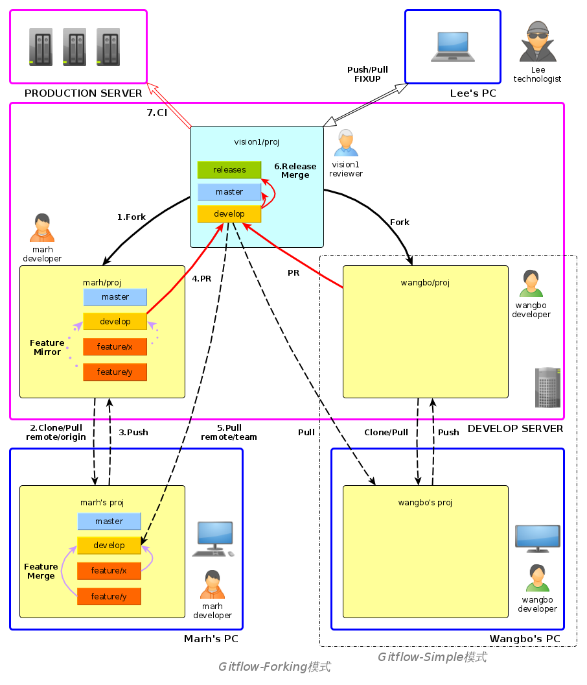

# GitFlow项目介绍

为了更有力，更深度，更快速的协作开发。并且更好的进行版本管理和控制项目代码，我们将采用自定义的GitFlow工作流模式。


## 术语定义
- gitweb: 服务器上git的web平台，用于存放代码。如github, 内部的gitea等
- 箭头信息流表达（=>,->）: 其中双箭头=>表示服务器上repo之间的信息流，通过web按钮实现, 单箭头为本地到服务器之间的信息流

## 总体原则和指导
- **master干净**。master干净不被污染，必须可运行。开发主要都在develop上完成，不论本地还是远程。develop测试通过以后，将其合并到master.
- **PR控制**。PR=Pull Request, 合并请求。代码管理的本质是对PR的管理。目标仓库的更改只能通过审核者通过的PR。不能直接更改，保证纯洁性。审核者只拥有主库的合并请求的权限，并没有主库的代码开发和推送权限。gitweb上PR面板中可用来审核者和开发者深入交流讨论该PR的细节。鼓励审核者和开发者多交流。
- **分布开发**。每个开发者各开发各的，通过提交PR实现主仓库的功能更新。开发者日常都是在操作自己的镜像库，并及时从主库更新本地的代码。开发到一定阶段，主要功能完成，可以PR合并到主库。
- **合并冲突本地化**。冲突来自于不一致，当主库被别人更新，自己本地又有更新时。从主库pull的时候就有发生冲突的可能性。在本地解决冲突，解决完和主库同步后，再提交新的修改。创建PR。若没解决冲突，提交的PR是无法被合并到主库的。所以，鼓励开发者从主库多pull, 勤pull，保证一致。不要拖得太久，不然主库和本地差异过大时，本地解决冲突变成一件难事。
- **ISSUES建议**。其他人对项目的一些修改意见，但是无开发权限，如管理层人员之类的，可以通过gitweb上该项目的ISSUES面板提出建议，开发者根据情况回应。鼓励多讨论多提建议。

# 目录

* [1.Git基本操作](#1.git基本操作)
  * [1.1.本地操作](#1.1.本地操作)
  * [1.2.远程操作](#1.2.远程操作)
* [Gitflow简介](#gitflow简介)
  * [分支简介](#分支简介)
  * [流程概述](#流程概述)
* [Gitflow功能命令](#gitflow功能命令)
* [Gitflow简单示范](#gitflow简单示范)
* [小贴士Tips](#小贴士tips)

# 1.Git基本操作

这里只介绍部分操作，更多git的操作参考[廖雪峰的教程](https://www.liaoxuefeng.com/wiki/896043488029600)。适用于单人本地以及**单人本地远程1对1操作**。本地与远程进行同步推拉(Push,Pull)

## 1.1.本地操作
```shell
git init #在一个文件夹下初始化git
git add #将更新过的文件添加到git缓存中
git commit #将添加到缓存中的更新提交到分支中
git branch #在当前分支创建新的分支
git checkout #切换到指定分支
git clone #从某个远程网站克隆一个项目到当前工作路径，url指远程仓库的地址
git pull #远程拉取镜像,remote指远程仓库名，branch指要下载的分支名
git push #将本地分支上传到远程分支
git merge #分支合并
```

## 1.2.远程操作
在gitweb平台上，该项目远程仓库上的重要操作：
- Fork：将看中的仓库拉到自己的远程仓库中，由开发者执行
- Pull request：简写成PR，发送子分支合并请求，等待审核(Code Review)，由开发者执行
- Merge request ： 同意合并请求, 由审核者执行

# Gitflow简介

GitFlow工作流定义了一个围绕项目发布的严格分支模型，它为不同的分支分配了明确的角色，并定义分支之间何时以及如何进行交互。[视频简介](https://www.bilibili.com/video/av32573821/)。适用于**多人操作一个共享仓库的情况**，小范围协作。

## 分支简介

GitFlow主要包含了以下分支：
1. **master分支**：存储正式发布的产品，master分支上的产品要求随时处于可部署状态。master分支只能通过与其他分支合并请求PR来更新内容，禁止直接在master分支进行修改。
1. **develop分支**：汇总开发者完成的工作成果，develop分支上的产品可以是缺失功能模块的半成品，但是已有的功能模块不能是半成品。develop分支只能通过与其他分支合并来更新内容，禁止直接在develop分支进行修改。
1. **feature分支**：当要开发新功能或者试验新功能时，从develop分支创建一个新的feature分支，并在feature分支上进行开发。开发完成后，需要将该feature分支合并到develop分支，最后删除该feature分支。
1. **release分支**：当develop分支上的项目准备发布时，从develop分支上创建一个新的release分支，新建的release分支只能进行质量测试、bug修复、文档生成等面向发布的任务，不能再添加功能。这一系列发布任务完成后，需要将release分支合并到master分支上，并根据版本号为master分支添加tag，然后将release分支创建以来的修改合并回develop分支，最后删除release分支。
1. **hotfix分支**：当master分支中的产品出现需要立即修复的bug时，从master分支上创建一个新的hotfix分支，并在hotfix分支上进行bug修复。修复完成后，需要将hotfix分支合并到master分支和develop分支，并为master分支添加新的版本号tag，最后删除hotfix分支。


## 流程概述

完整的GitFlow分支适用于中大项目，操作起来较为复杂。在一般的小规模项目中，我们对gitflow实施了定制。只保留核心的master和develop分支，便于实践和推广。

下面[演示](#gitflow简单示范)部分用两个账号做示范，一个账号vision1是项目的创建者和审核者（对应于左图）,一个用户wangbo是开发人员（对应于右图）

主要步骤如下：
1. **Init 项目组创建项目**.  vision1/proj. ，由vision1完成，创建项目主仓库vision1/proj，并默认master分支。
1. **Develop 开发者fork项目并开发**. vision1/proj/develop => wangbo/proj/develop <-> wangbo's proj/develop.

   1. 由wangbo fork主仓库到wangbo对该项目的远程镜像仓wangbo/proj，落在git服务器wangbo帐号下，然后wangbo clone到本地仓wangbo's proj。

   2. 创建develop分支。wangbo后续的开发都是基于本地的develop和远程的镜像仓协同开发。
   3. wangbo应实时拉取主仓库，并和本地合并，保持最新状态。

2. **Merge 审核者审核并合并项目**. wangbo/proj/develop => vision1/proj/develop wangbo远程仓ready后. 合并分支，开发者wangbo请求合并自己的远程仓的develop分支到主仓库的develop分支，vision1审核通过
3. **Release 审核者发布版本**. vision1/proj/develop => vision1/proj/master. 审核者vision1根据需求发布，把主仓库develop merge到master，并根据情况打tag

# Gitflow功能命令

## 向主库贡献代码

贡献代码的主要步骤是克隆(clone)，开发(develop)与合并(merge)，具体如下：
1. **Fork**. 在gitweb中，目标项目{REMOTE_REPO}={TARGET_USER}/{PROJECT}上点击fork,会生成自己的项目 {USER}/{PROJECT}. e.g. vision1/proj => wangbo/proj
2. **Clone**. `git clone {URL}`.
3. **Develop**. `git add {FILES}`，`git commit -m "{COMMIT_MESSAGE}"` 进行更新，提交到本地
4. **Push** `git push origin develop` 推送到自己的远程仓库  wangbo/proj/develop
5. **PR**. web上打开`Pull Request` 请求, 等待审核。
6. **Merge**. 审核者vision1会审核你提交的代码，若没问题则接受合并。若有问题，双方在PR面板上交流讨论后，继续改进后续再次提交PR或者开发者说服审核者通过该PR.

当我们睡了一觉起来， 目标仓库(e.g. vision1/proj)可能已经更新，我们要同步最新代码。

## 在本地更新代码

更新本地代码主要是拉取操作(pull)，具体如下：
1. 确保本地在develop分支
2. 给远程的上游仓库vision1/proj配置一个remote。
3. 查看远程状态 `git remote -v`
4. 配置remote上游. `git remote add {REMOTE_NAME} {REMOTE_REPO}`. e.g：`git remote add team https://xxx.com/vision1/proj.git`
5. 将远程所有的分支fetch下来 `git fetch team`
6. 合并`git merge team`
7. 或者`git pull team develop`。 `git pull = fetch + merge`

此时自己本地的代码就是最新的了。功能修改完成后，可继续提交合并请求PR

# Gitflow简单示范

下面用两个账号做演示，一个叫vision1，一个叫wangbo，vision1负责创建项目并审核，wangbo负责开发并提交审核。
为了方便观察，以下图中，都将vision1仓库放到屏幕左侧，wangbo的放到右侧。

## 1.创建主仓库

由vision1创建主仓库


此时，远程仓库并没有内容，vision1在本地创建仓库，添加内容，提交生成第一个分支master,并在master分支下创建了子分支develop，并添加提交了属于子分支的内容（develop.txt）,代码如下:

```shell
#初始化一个仓库（如果是git clone就不必初始化，git clone会自动帮你初始化）
git init
#生成了readme.txt文件，并提交到git中，因为没有分支，git会默认帮你创建一个master分支
touch readme.txt
git add readme.txt      #这一步会添加r
git commit -m "这是第一次提交，会默认创建master分支"
#在新生成的master分支上建一个develop分支
git branch develop
#从master分支切换到develop分支
git checkout develop
#在develop分支上开发，这里生成了develop.txt，并提交到了develop分支
touch develop.txt
git add develop.txt
git commit -m "基于master分支生成了develop分支，并添加了develop.txt"
#添加vision1的远程仓库，并给他一个别名为proj
git remote add proj https://git.qingtong123.com/vision1/proj.git
#将本地仓库推送到远程仓库，这里-all表示所有分支
git push proj -all
```


## 2.Fork

wangbo从vision1的仓库fork过来项目


## 3.Clone

wangbo从自己的远程仓库clone到本地仓库

```shell
git clone -b develop https://git.qingtong123.com/wangbo/proj.git 
```

这里"-b develop"用来指定clone仓库中的develop分支，如果不加，会默认clone master分支

## 4.Develop

wangbo在自己的本地仓库完成开发,并提交到develop分支

```shell
#clone会把proj下面所有文件拷贝到本地，proj文件夹也包括，而git只管理proj下的内容，所以要进proj文件夹操作
cd proj
#开发内容并提交到develop分支
touch wangbo.txt
git add wangbo.txt
git commit -m "在develop分支下开发了wangbo.txt"

```

## 5.Push

这时wangbo本地仓库中的develop开发完毕，要push到远程仓库

```shell
#将本地develop分支push到远程仓库的develop，这里第一个develop指本地分支，第二个指远程分支
git push origin develop:develop
```

push过去后如图


## 6.Pr

wangbo在自己仓库中申请将自己的develop分支合并到主仓库


## 7.Merge

vision1收到合并请求的消息，审核后通过


## 8.剩下的工作

以上就完成了一次开发，后面的工作就是重复第4-7步，当然开发过程中wangbo也可以像第1步中vision1创建develop分支那样创建自己的分支feature，并在新的分支上执行4-7（新的分支也要同步到远程仓库）

另外，如果开发者wangbo有两台机器，并在两台机器上都做开发，有一台机器上的代码版本落后于另一台，那么在版本落后的机器上开发时就需要通过git服务器将最新的代码pull到落后机器本地仓库，如下：
```shell
git pull proj/wangbo develop:develop
```
pull下来后，参照第4-7步进行就OK了

# 小贴士Tips

- 作为专业的开发人员，推荐使用英文原版gitea web界面
- 可以为主库添加watch, 这样主库如果发生更新，能够有消息提醒请及时从主库pull
- 本地库也开develop分支，这样推送的时候git会匹配分支，将本地的develop推送到远程镜像的develop

- 远程仓库可以在仓库Settings页面中Branches里面设置develop为默认展示分支


- 设置分支上游 git push --set-upstream origin {{REMOTE_BRANCH_NAME}} e.g. 本地分支切换到develop后 git push --set-upstream origin develop, 本地分支与远程分支名称保持一致。

- git stash 合理的使用会简化你的工作。比如git pull的时候要求本地workspace没有临时更改, 但是修改了又没提交怎么办，此时可以git stash保存先藏起来， git pull更新，然后git stash pop再弹出来合并

- 开发者本地最好有个develop分支，推送的时候git会自动匹配名字。当你在develop分支上git push, git会自动推到develop上

- 在commit时， 如果message中有类似  "Fixes", "Fixed", "Fix", "Closes", "Closed"， "Close"等字样, 可以直接在push时关闭对应的issue, 例如 git commit -m "Close #1"， 即可关闭#1 issue

- 开发推荐使用zsh, 能够实时显示项目当前所在的分支，ohmyzsh设置漂亮的主题 https://ohmyz.sh/

