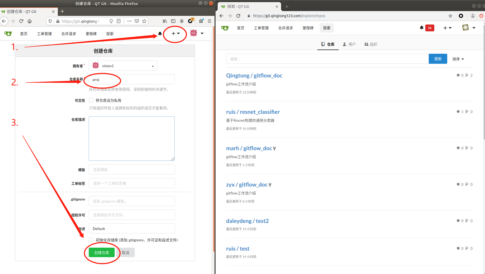

# GitFlow项目介绍

为了更有力，更深度，更快速的协作开发。并且更好的进行版本管理和控制项目代码，我们将采用自定义的GitFlow工作流模式。
完整的GitFlow分支适用于中大项目，操作起来较为复杂。在一般的小规模项目中，我们对gitflow实施了定制。只保留核心的master和develop分支，便于实践和推广。
流程示例如下：

图中，虚线箭头为跨机器信息流，红箭头表示关键步骤，虚点为镜像分支关系。

## 术语定义

- gitweb: 服务器上git的web平台，用于存放代码。如github, 内部的gitea等
- 箭头信息流表达（=>,->）: 其中双箭头=>表示服务器上repo之间的信息流，通过web按钮实现, 单箭头为本地到服务器之间的信息流
- vision1/proj: 主仓库，wangbo/proj: wangbo的远程镜像仓, wangbo's proj: wangbo的本地镜像仓
- Fork: 镜像整个项目
- Pull: 从远程拉取到本地
- Push: 从本地推送到远程
- Merge: 本地分支之间合并
- PR: Pull Requests, 一个仓库向另一个仓库提交的合并请求

## 主要流程
主要流程如下：
1. **Init 项目组创建项目**.  vision1/proj. ，由vision1完成，创建项目主仓库vision1/proj，创建相应的develop分支。
2. **Develop 开发者fork项目并开发**. vision1/proj/develop => wangbo/proj/develop <-> wangbo's proj/develop.

   1. 由wangbo fork主仓库到wangbo对该项目的远程镜像仓wangbo/proj，落在git服务器wangbo帐号下，然后wangbo clone所有分支到本地仓wangbo's proj。

   2. wangbo后续的开发都是基于本地仓wangbo's proj和wangbo的镜像仓wangbo/proj同步开发。期间可以开发多个特性分支，并定期合并到本地的develop分支。
   3. wangbo应实时拉取(pull)主仓库vision1/proj，并和本地合并(merge)，保持develop分支最新状态。

3. **Merge 审核者审核并合并项目**. wangbo/proj/develop => vision1/proj/develop 镜像仓wangbo/proj准备好后. wangbo请求合并自己的远程仓的develop分支到主仓库的develop分支，vision1进行审核，决定接受PR或者打回重改。
4. **Release 审核者发布版本**. vision1/proj/develop => vision1/proj/master. 审核者vision1根据需求发布，把主仓库develop merge到master，并根据情况打tag

后文[演示](#4-gitflow简单示范)部分用两个账号做示范。

## 总体原则和指导
- **master干净**。master干净不被污染，必须可运行。开发主要都在develop上完成，不论本地还是远程。主仓库develop测试通过以后，审核者将其合并到master. 主仓库master一定是干净的。本地和镜像仓的master可以适时从主库合并master，来同步一个可用版本。
- **PR控制**。PR=Pull Request, 合并请求。代码管理的本质是对PR的管理。目标仓库的更改只能通过审核者通过的PR。不能直接更改，保证纯洁性。审核者只拥有主库的合并请求的权限，并没有主库的代码开发和推送权限。gitweb上PR面板中可用来审核者和开发者深入交流讨论该PR的细节。鼓励审核者和开发者多交流。
- **分布开发**。每个开发者各开发各的，通过提交PR实现主仓库的功能更新。开发者日常都是在操作自己的镜像库，并及时从主库更新本地的代码。开发到一定阶段，主要功能完成，可以PR合并到主库。
- **合并优先级**。对于开发者而言，合并的操作主要在本地完成。合并的来源有三处，远程主仓库，本地其他特性分支，本地修改。当切换电脑时，还有远程镜像仓库。合并的优先级是先远后近。主仓库 > 镜像仓库 > 本地其他分支 > 本地更改。
- **合并冲突本地化**。冲突来自于不一致，当主库被别人更新，自己本地又有更新时。从主库pull的时候就有发生冲突的可能性。在本地解决冲突，解决完和主库同步后，再提交新的修改。创建PR。若没解决冲突，提交的PR是无法被合并到主库的。所以，鼓励开发者从主库多pull, 勤pull，保证一致。不要拖得太久，不然主库和本地差异过大时，本地解决冲突变成一件难事。
- **ISSUES建议**。其他人对项目的一些修改意见，但是无开发权限，如管理层人员之类的，可以通过gitweb上该项目的ISSUES面板提出建议，开发者根据情况回应。鼓励多讨论多提建议。

# 目录

* [1.Git基本操作](#1-git基本操作)
  * [1.1.本地操作](#1-1-本地操作)
  * [1.2.远程操作](#1-2-远程操作)
* [2.Gitflow简介](#2-gitflow简介)
* [3.Gitflow功能命令集](#3-gitflow功能命令集)
* [4.Gitflow简单示范](#4-gitflow简单示范)
* [小贴士Tips](#小贴士tips)

# 1.Git基本操作

这里只介绍部分操作，更多git的操作参考[廖雪峰的教程](https://www.liaoxuefeng.com/wiki/896043488029600)。适用于单人本地以及**单人本地远程1对1操作**。本地与远程进行同步推拉(Push,Pull)

## 1.1.本地git命令行操作

```shell
git init #在一个文件夹下初始化git
git add {FILES} #将更新过的文件添加到git缓存中
git commit -m {COMMIT_MESSAGE}#将添加到缓存中的更新提交到分支中
git branch {BRANCH} #在当前分支创建新的分支
git checkout {BRANCH} #切换到指定分支
git clone {REPO_URL}#从克隆远程仓库到当前工作路径
git pull {REMOTE_NAME} {BRANCH} #远程指定分支拉取到本地当前分支
git push {REMOTE_NAME} {BRANCH} #将本地当前分支推到远程指定分支
git merge {BRANCH} #将本地{BRANCH}合并到当前分支
```

## 1.2.本地git GUI操作

TODO

## 1.2.远程gitweb图形化操作

- Fork：开发者将主仓库拉到自己的镜像仓库中。
- Pull request：简写成PR，开发者在自己的镜像仓发送子分支合并请求，等待审核者审核(Code Review)。
- Merge request ： 审核者在主仓库执行同意合并请求

# 2.Gitflow简介

GitFlow工作流定义了一个围绕项目发布的严格分支模型，它为不同的分支分配了明确的角色，并定义分支之间何时以及如何进行交互。[视频简介](https://www.bilibili.com/video/av32573821/)。适用于**多人操作一个共享仓库的情况**，小范围协作。

GitFlow主要包含了以下分支：
1. **master分支**：存储正式发布的产品，master分支上的产品要求随时处于可部署状态。master分支只能通过与其他分支合并请求PR来更新内容，禁止直接在master分支进行修改。
1. **develop分支**：汇总开发者完成的工作成果，develop分支上的产品可以是缺失功能模块的半成品，但是已有的功能模块不能是半成品。develop分支只能通过与其他分支合并来更新内容，禁止直接在develop分支进行修改。
1. **feature分支**：当要开发新功能或者试验新功能时，从develop分支创建一个新的feature分支，并在feature分支上进行开发。开发完成后，需要将该feature分支合并到develop分支，最后删除该feature分支。
1. **release分支**：当develop分支上的项目准备发布时，从develop分支上创建一个新的release分支，新建的release分支只能进行质量测试、bug修复、文档生成等面向发布的任务，不能再添加功能。这一系列发布任务完成后，需要将release分支合并到master分支上，并根据版本号为master分支添加tag，然后将release分支创建以来的修改合并回develop分支，最后删除release分支。
1. **hotfix分支**：当master分支中的产品出现需要立即修复的bug时，从master分支上创建一个新的hotfix分支，并在hotfix分支上进行bug修复。修复完成后，需要将hotfix分支合并到master分支和develop分支，并为master分支添加新的版本号tag，最后删除hotfix分支。


# 3.Gitflow功能命令集

下面以功能角度介绍命令流程。

## 3.1.向主库贡献代码

贡献代码的主要步骤是克隆(clone)，开发(develop)与合并(merge)，具体如下：
1. **Fork**. vision1/proj => wangbo/proj 在gitweb中，目标项目{REMOTE_REPO}={TARGET_USER}/{PROJECT}上点击fork,会生成自己的项目 {USER}/{PROJECT}. 
2. **Clone**.  wangbo/proj -> wangbo's proj 开发者将镜像仓clone到本地 `git clone {REPO_URL}`. 且初始化的分支主仓库上游`git remote add team {ADDR}/vision1/proj.git`. 查看远程状态 `git remote -v`. `team`为主库对应的remote名称
3. **Develop**. wangbo进行更新，提交到本地. `git add {FILES}`，`git commit -m "{COMMIT_MESSAGE}"` 
4. **Push** wangbo推送到自己的远程仓库wangbo's proj/develop -> wangbo/proj/develop `git push origin develop` 
5. **PR**. wangbo gitweb上打开`Pull Request` 请求, 等待审核。
6. **Merge**. 审核者vision1会审核你提交的代码，若没问题则接受合并。若有问题，双方在PR面板上交流讨论后，继续改进后续再次提交PR或者开发者说服审核者通过该PR.

当我们睡了一觉起来， 目标仓库(e.g. vision1/proj)可能已经更新，我们要同步最新代码。

## 3.2.在本地更新代码

wangbo更新本地代码主要是拉取操作(pull)，具体如下：
1. 确保本地在develop分支
2. 给远程的上游仓库vision1/proj配置一个remote。
3. 将远程所有的分支fetch下来 `git fetch team`
4. 合并`git merge team`
5. 或者`git pull team develop`。git pull = fetch + merge, 若初始化合适,develop可省略，直接`git pull team`

此时自己本地的代码就是最新的了。功能修改完成后，可继续提交合并请求PR

# 4.Gitflow简单示范

完整的GitFlow分支适用于中大项目，操作起来较为复杂。在一般的小规模项目中，我们对gitflow实施了定制。只保留核心的master和develop分支，便于实践和推广。

下面用两个账号做演示，一个叫vision1，一个叫wangbo，vision1负责创建项目并审核，wangbo负责开发并提交审核。
为了方便观察，以下图中，都将vision1仓库放到屏幕左侧，wangbo的放到右侧。

## 4.1.创建主仓库

由vision1创建主仓库




此时，远程仓库并没有内容，vision1在本地创建仓库，添加内容，提交生成第一个分支master,并在master分支下创建了子分支develop，并添加提交了属于子分支的内容（develop.txt）,代码如下:

```shell
#初始化一个仓库（如果是git clone就不必初始化，git clone会自动帮你初始化）
vision1:proj> git init
#生成了readme.txt文件，并提交到git中，因为没有分支，git会默认帮你创建一个master分支
vision1:proj(master)> touch readme.txt
vision1:proj(master)> git add readme.txt      #这一步会添加r
vision1:proj(master)> git commit -m "这是第一次提交，会默认提交到master分支"
#在新生成的master分支上建一个develop分支
vision1:proj(master)> git branch develop
#从master分支切换到develop分支
vision1:proj(master)> git checkout develop # 或者直接git checkout -b develop
#在develop分支上开发，这里生成了develop.txt，并提交到了develop分支
vision1:proj(develop)> touch develop.txt
vision1:proj(develop)> git add develop.txt
vision1:proj(develop)> git commit -m "基于master分支生成了develop分支，并添加了develop.txt"
#添加vision1的远程仓库，并给他一个别名为proj
vision1:proj(develop)> git remote add origin https://git.qingtong123.com/vision1/proj.git
#将本地仓库推送到远程仓库，这里-all表示所有分支
vision1:proj(develop)> git push origin -all #或者git push
```


## 4.2.Fork

wangbo从vision1的仓库fork过来项目


## 4.3.Clone

wangbo从自己的远程仓库clone到本地仓库

```shell
wangbo> git clone -b develop https://git.qingtong123.com/wangbo/proj.git 
```

这里"-b develop"用来指定clone仓库中的develop分支，如果不加，会默认clone master分支

## 4.4.Develop

wangbo在自己的本地仓库完成开发,并提交到develop分支

```shell
#clone会把proj下面所有文件拷贝到本地，proj文件夹也包括，而git只管理proj下的内容，所以要进proj文件夹操作
wangbo> cd proj
wangbo:proj(master)> git checkout develop
#开发内容并提交到develop分支
wangbo:proj(develop)> touch wangbo.txt
wangbo:proj(develop)> git add wangbo.txt
wangbo:proj(develop)> git commit -m "在develop分支下开发了wangbo.txt"

```

## 4.5.Push

这时wangbo本地仓库中的develop开发完毕，要push到远程仓库

```shell
#将本地develop分支push到远程仓库的develop，这里第一个develop指本地分支，第二个指远程分支
wangbo:proj(develop)> git push origin develop:develop # 直接git push
```

push过去后如图


## 4.6.Pull Request(PR)

wangbo在自己仓库中申请将自己的develop分支合并到主仓库


## 4.7.Merge

vision1收到合并请求的消息，审核后通过


## 4.8.剩下的工作

以上就完成了一次开发，后面的工作就是重复第4-7步，当然开发过程中wangbo也可以像第1步中vision1创建develop分支那样创建自己的分支feature，并在新的分支上执行4-7（新的分支也要同步到远程仓库）

另外，如果开发者wangbo有两台机器，并在两台机器上都做开发，有一台机器上的代码版本落后于另一台，那么在版本落后的机器上开发时就需要通过git服务器将最新的代码pull到落后机器本地仓库，如下：
```shell
wangbo:proj(develop)> git pull {REPO_URL}/proj/wangbo develop:develop # 配置好上游以后可直接git pull
```
pull下来后，参照第4-7步进行就OK了

# 小贴士Tips

- 如果你觉得我们定制的GitFlow流程复杂，那一定是你的git推拉基本功不够，抓紧补课。我们已经是极简的Flow了。
  
- 作为专业的开发人员，推荐使用英文原版gitea web界面
  
- 开发推荐使用zsh, 能够实时显示项目当前所在的分支，ohmyzsh设置漂亮的主题 https://ohmyz.sh/


- git相关的配置信息在配置文档里，如remote名字地址，合并信息等，项目相关的.git/config里，全局的在~/.gitconfig. 有时候，直接文本修改git config文件更方便
  
- git中一切可配置。如果你总是重复输入一个固定的东西，那那个东西一定可配置，使得你不用重复输入。例如如果每次都运行git pull team develop，那么team和develop信息是可配置的（具体配置命令自己查），配置完以后git pull即可。配置的信息存在.git/config里面。
  
- 每个项目git初始化是会产生一个默认的master分支

- 本开发者地库也开develop分支，这样推送的时候git会匹配分支，将本地的develop推送到上游仓库的develop

- 设置分支上游 git push --set-upstream origin {{REMOTE_BRANCH_NAME}} e.g. 本地分支切换到develop后 git push --set-upstream origin develop, 本地分支与远程分支名称保持一致。

- git stash 合理的使用会简化你的工作。比如git pull的时候要求本地workspace没有临时更改, 但是修改了又没提交怎么办，此时可以git stash保存先藏起来， git pull更新，然后git stash pop再弹出来合并

- 可以为主库添加watch, 这样主库如果发生更新，能够有消息提醒请及时从主库pull

- md文档在gitweb上可以直接编辑提交预览，有时候更方便

- 在commit时， 如果message中有类似  "Fixes", "Fixed", "Fix", "Closes", "Closed"， "Close"等字样, 可以直接在push时关闭对应的issue, 例如 git commit -m "Close #1"， 即可关闭#1 issue

- gitweb上可以在仓库Settings页面中Branches里面设置develop为默认展示分支

- gitweb上调试带图片的文档时，要禁用浏览器缓存，否则图片不更新。chrome中F12进入开发者工具，Network中点击Disable cache即可
