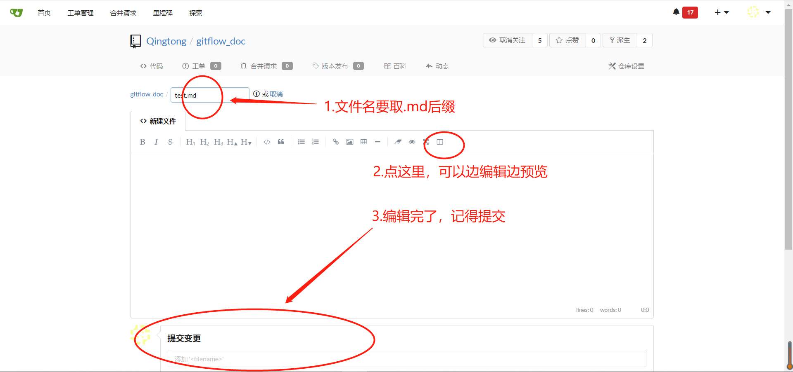

# 目录

* [1.Markdown简介](#1-markdown简介)
* [2.Markdown使用](#2-markdown使用)

# 1.Markdown简介
## 是什么

Markdown是一种可以使用普通文本编辑器编写的标记语言，通过简单的标记语法，它可以使普通文本内容具有一定的格式。

## 特点
1. Markdown将编辑与预览分开。
    
   如下图，左侧是编辑的内容，右侧是预览图
   
   

2. Markdown用文本编辑的方式完成所有的展示，而传统的文档编写时还会需要一些别的操作。

   比如:插入图片
   
   传统编辑方式做法是：右键->插入图片->调整位置（比如：居中什么的）。或者ctrl+v粘贴。
   
   Markdown的做法是：用一行文本来完成，你只需要知道图片在电脑中的地址，然后将图片地址填入括号中就可以了。如下图，
   
   
   
   另外，你也可以插入网络图片，只要你知道它的网络地址
    
   

# 2.Markdown使用
## 编辑工具

1. 咱们的云笔记(https://note.qingtong123.com/)

2. vscode插件
    1. Markdown Preview Enhanced,可以边编辑边预览，右键使用
    2. Markdown PDF，可以将markdown预览导出成pdf，html，jpeg等文件
    

3. git服务器上的编辑器

    使用方法如下：
    
    
    
    
    
4. bookstack

## 教程

这个是[基础用法](https://www.runoob.com/markdown/md-tutorial.html),剩下的插入表格，生成列表等特殊用法可以百度查找，都是很简单的语法
